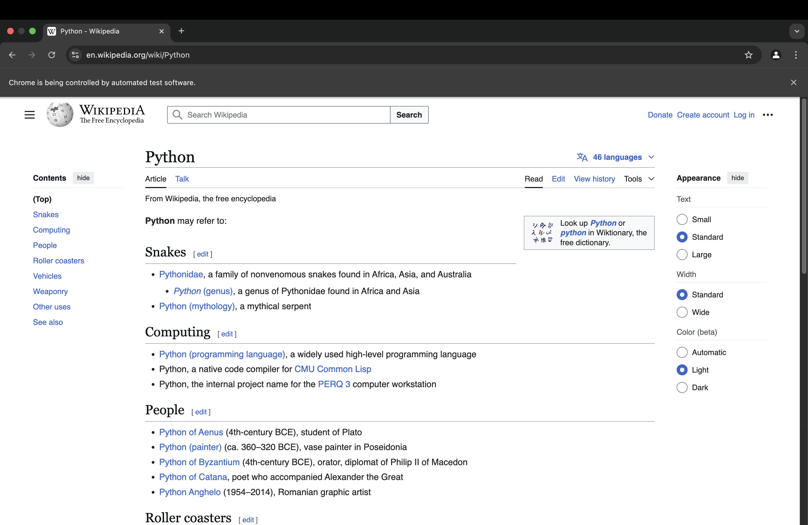

# 🔍 Wikipedia Search Automation using Selenium

This is a simple Python automation script that uses **Selenium WebDriver** to interact with [Wikipedia](https://www.wikipedia.org). The script opens the Wikipedia main page and performs a search for the term **"Python"** automatically.

## 📌 Features

- Launches the Chrome browser using Selenium
- Opens Wikipedia's main page
- Automatically searches for "Python"
- Simulates the Enter key press to show results
- Keeps the browser open after execution (using `detach`)

## 🛠️ Requirements

Make sure the following are installed:

- Python 3.x
- Google Chrome browser
- ChromeDriver (compatible with your Chrome version)

## Result

The following snapshot is the result of the automation:

